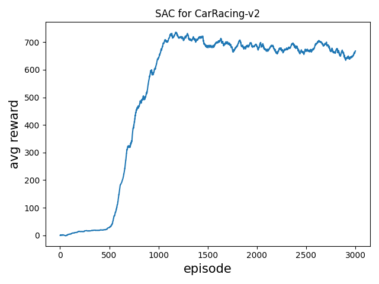
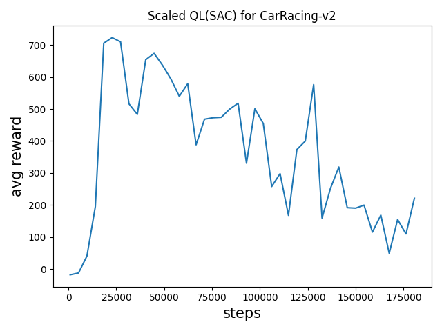

# ScaledQL
Code for Scaled Q-Learning

## Performance

## Reference
["Offline Q-Learning on Diverse Multi-Task Data Both Scales And Generalizes"]
(https://arxiv.org/abs/2211.15144)

["Conservative Q-Learing for Offline Reinforcement Learning]
(https://arxiv.org/abs/2006.04779)

["A Distributional Perspective on Reinforcement Learning"]
(https://arxiv.org/abs/1707.06887)
